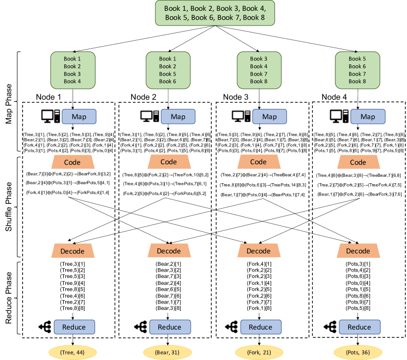
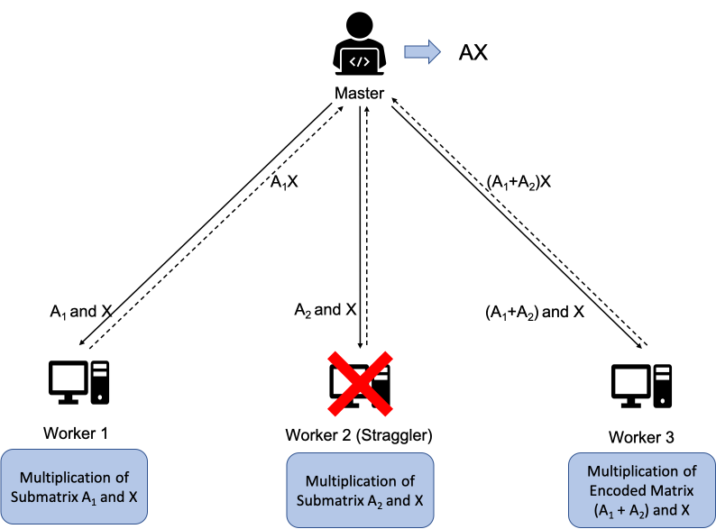
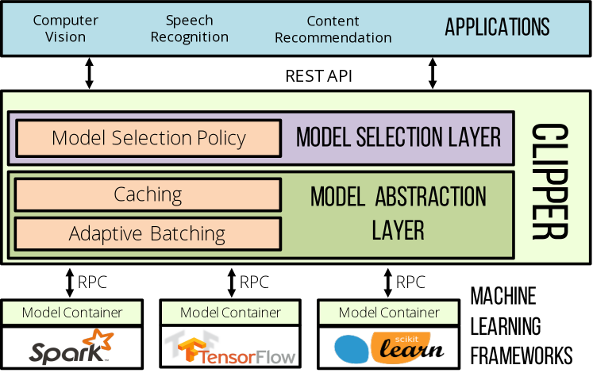
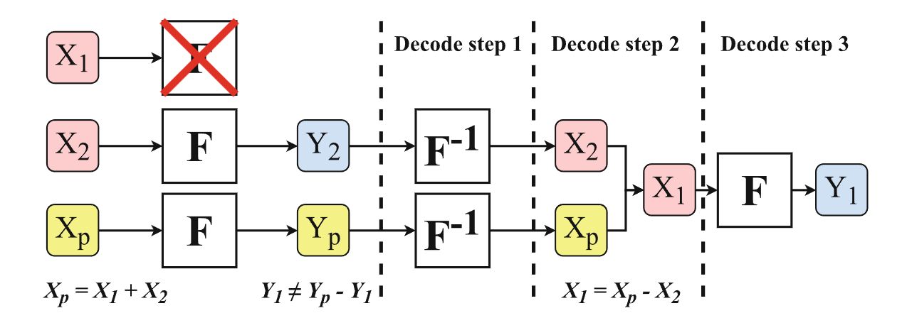
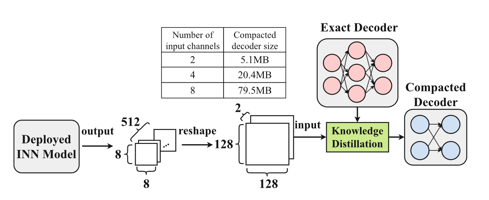

# 背景知识

## Coded Distributed Computing

[A Survey of Coded Distributed Computing](https://arxiv.org/abs/2008.09048)

分布式计算具有高可靠性、可扩展性、计算速度和成本效益等优点，已成为大规模任务计算的常用方法。但是，分布式计算面临着与通信负载和落后效应相关的关键问题。特别是，计算节点需要相互交换中间结果才能计算出最终结果，这大大增加了通信开销。此外，分布式计算网络可能包括间歇性运行速度较慢的散落节点。这会导致执行计算任务所需的总时间更长，从而限制分布式计算的性能。为了解决这些问题，**编码分布式计算 （CDC），即编码理论技术和分布式计算的结合，最近被提出为一种很有前途的解决方案**。

分布式计算有两大挑战。首先，计算节点需要通过网络相互交换一些中间结果，以便计算最终结果;这大大增加了通信开销，并限制了分布式计算应用程序的性能。其次，分布式计算由大量的计算节点执行，这些节点可能具有非常不同的计算和网络资源。因此，存在落后节点或落后节点，即计算节点无意中比其他节点运行得慢，从而增加了完成计算任务所需的总时间。为了解决落后效应，分布式计算采用了工作交换 和朴素复制等传统方法。但是，这些方法要么引入冗余，要么需要节点之间的协调，这会显著增加通信成本和计算负载。 这激发了对一种新技术的需求，该技术能够更有效、更完整地解决分布式计算的落后效应和通信负载。

编码理论技术，例如低密度奇偶校验 （LDPC）等信道编码，已广泛用于 WiFi 和蜂窝系统，以对抗信道噪声和损伤的影响。它们还应用于分布式存储系统和缓存网络，以降低存储成本和网络流量。**编码理论技术的基本原理是，在消息/信号传输到接收者之前，将冗余信息（即冗余）引入消息/信号中。冗余以控制器的方式包含在消息中，以便接收器可以利用它来纠正由信道噪声引起的错误。**编码理论技术最近被认为是应对分布式计算挑战的有前途的解决方案。**例如，可以使用编码理论技术对计算节点的 Map 任务进行编码，以便主节点能够从部分完成的节点中恢复最终结果，从而减轻落后效应。另一个例子是，编码理论技术为分布式计算任务的中间结果提供了编码机会，通过减少处理节点之间数据传输的数量和大小，显著减少了通信负载。**编码技术和分布式计算的组合称为编码分布式计算 （CDC） 。 除了减少通信负载和减轻落后者的影响外，CDC 还可以提供容错、保护隐私并提高分布式计算的安全性。

### II 编码分布式计算基础

#### II-A 编码分布式计算框架

主要讨论 map-reduce

#### II-B CDC 方案的目标

CDC 有两条主要工作线。首先，实现 CDC 方案以最小化分布式计算系统中的通信负载。其次，CDC 方案旨在减轻导致分布式任务计算延迟的落后效应。

### III 编码分布式计算（CDC）方案

朴素复制方案，可以通过允许将每个子文件复制并映射到多个处理节点来降低系统的通信成本。

在 Map 阶段之后，处理节点多播两个计算的中间对的按位 XOR，用 ⊕ 表示，同时满足其他两个处理节点的要求。例如，节点 1 将 “Bear” 和 “Fork” 的按位 XOR 组播到节点 2 和 3，这只涉及传输一个信息包，如果信息以单播方式分别发送到节点，则只涉及两个数据包的传输。由于中间输出对现在已经编码，因此在应用 reduce 函数之前还有一个额外的解码步骤。给定编码的 “BearFork” 信息，节点 2 能够通过取消 “Fork” 信息来解码和恢复所需的 “Bear” 信息，因为节点 2 也计算了相同的 “Fork” 信息。同样，节点 3 可以通过取消 “Bear” 信息来恢复 “Fork” 信息。

除了减少 MapReduce 框架的 Shuffle 阶段的通信负载外，还可以使用编码技术来减轻落后效应。由于矩阵乘法是分布式计算系统中使用的最基本的线性运算之一，因此 某篇论文 中提出了一种编码计算框架，以最大限度地减少分布式矩阵乘法任务的计算延迟。编码计算框架使用纠删码生成冗余的中间计算。特别是，主节点对大小相等的数据块（即子矩阵）进行编码，并将它们分配给 worker 以计算局部函数。完成后，工作程序将计算结果传输到主节点。一旦任何可解码集的本地计算完成，主节点就可以通过使用解码函数来恢复最终结果。如图所示，主节点可以在收到来自任意 2 个 worker 的计算结果时恢复最终结果，而不是所有 3 个 worker。因此，总计算量不是由最慢的落后者决定的，而是由主节点从一些可解码的索引集接收计算结果的时间决定的。

尽管 MDS 代码能够减轻落后效应，但它不能推广到所有类型的计算任务。为了减轻不同分布式计算任务的落后效应，可以通过利用特定操作的代数结构来设计编码技术。在这里，我们讨论了各种类型计算任务的编码技术，即 （i） 矩阵-向量乘法，（ii） 矩阵-矩阵乘法，（iii） 梯度下降，（iv） 卷积和傅里叶变换。略

统一编码方案通过将 MDS 代码应用于 Map 任务并复制编码的 Map 任务来利用这两种编码方法的优势。具体来说，统一编码方案首先对矩阵的行进行编码，然后矩阵的编码行以特定模式复制并存储在处理节点上。然后，处理节点执行计算，直到一定数量的最快处理节点完成其任务。为了减少 Shuffle 阶段的通信负载，使用编码多任务来交换在 Reduce 阶段恢复最终结果所需的中间结果。某篇论文通过利用重复码创建的冗余，对统一编码方案中提出的延迟-通信权衡进行了改进。通过提高重复代码的冗余率，可以同时改善 Shuffle 阶段的通信负载和 Map 阶段的计算延迟，从而有助于改善延迟-通信权衡。

## Prediction Serving System

[Clipper: A Low-Latency Online Prediction Serving System](https://arxiv.org/abs/1612.03079)

与由复杂的基础设施、理论和系统支持的模型开发不同，模型部署和预测服务受到的关注相对较少。开发人员必须从各种系统组件中拼凑出必要的部分，并且必须集成和支持跨多个不断发展的框架的推理，同时应对对可扩展性和响应能力不断增长的需求。因此，机器学习服务的部署、优化和维护非常困难且容易出错。

为了应对这些挑战，我们提出了 Clipper，这是一种分层架构系统，它降低了实现预测服务堆栈的复杂性，并实现了预测服务系统的三个关键属性：低延迟、高吞吐量和更高的准确性。Clipper 分为两层：（1） 模型抽象层，以及 （2） 模型选择层。第一层公开了一个通用 API，该 API 抽象出现有 ML 框架和模型的异构性。因此，可以对应用程序透明地修改或交换模型。模型选择层位于模型抽象层之上，动态选择和组合竞争模型中的预测，以提供更准确、更稳健的预测。

为了实现低延迟、高吞吐量的预测，Clipper 实施了一系列优化。在模型抽象层中，Clipper 基于每个模型缓存预测，并实现自适应批处理，以在给定查询延迟目标的情况下最大限度地提高吞吐量。在模型选择层，Clipper 实现了提高预测准确性和延迟的技术。为了提高准确性，Clipper 利用 bandit 和 ensemble 方法可靠地选择和组合来自多个模型的预测，并估计预测不确定性。此外，Clipper 能够为每个用户或会话独立调整模型选择。为了改善延迟，模型选择层采用落后缓解技术来呈现预测，而无需等待慢速模型。由于这种分层设计，最终用户应用程序和底层机器学习框架都不需要修改即可利用这些优化。

# Asymmetric Coded Distributed Computation for Resilient Prediction Serving Systems

译码器总是会被用到，解码器不一定被用到

AsymCDC ———— 由一个简单的译码器和一个复杂的解码器组成；简单的译码器降低延迟，复杂的解码器提高准确率

解码器：提出了一种基于可逆神经网络(INN)的精确译码方法，该方法可以在不损失精度的情况下重建离散结果; 提出了一种解码器压缩方法，该方法可以有效地利用知识提取(KD)技术，在略有精度损失的情况下得到一个小而快的解码器。

--- 12/04 Background and Related Work ---

## Background and Related Work

当前应用在PSS上最先进的CDC：ParM、ApproxIFER、Learned-CC

- ParM: 使用了一个基于学习的奇偶校验模型，这个模型的预测结果f'(xp)近似f(x1)+f(x2) (x1和x2为原始输入两个拆解的任务，xp为x1和x2计算出的奇偶校验任务)
- ApproxIFER: 在ParM的基础上，使用近似计算来提高精度。利用x1和x2的译码出x'1、x'2和x'3，可以利用f(x'2)和f(x'3)来解出f(x1)和f(x2)的近似解
- Learned-CC: 使用了基于神经网络的编码器和解码器

## Motivation

ob1: 简单的 SymCDC 具有较低的编码时间，而复杂的 SymCDC 具有较高的预测精度。
ob2: 落后者的比例远远低于非落后者。
=> 使用非对称的结构，简单的译码器和复杂的解码器

## Design

### framework

简单译码器：假设编码器将每个 k 输入任务 X1，X2，... ，Xk 编码成一个奇偶任务 Xp，Xp = 1/k * ∑ Xi。任务在相加之前乘以1/k 的原因是它可以将奇偶任务 Xp 的值范围保持在与其他任务相同的范围内。

复杂解码器：对于简单编码器生成的 k + 1任务，即 X1，X2，... ，Xk，Xp，部署模型对这些 k + 1任务进行推理，并返回 k + 1预测结果，即 Y1，Y2，... ，Yk，Yp。如果 Yi 是落后服务器的结果，解码器将用 Yi = D (Y1，... ，Yi-1，Yi + 1，... ，Yp)重建它，其中 D 表示基于神经网络的解码函数。

## exact decoder

Discution: 请注意，有人可能会说，只要将落后者的任务作为输入重新发送给已部署的模型，就可以实现精确的解码，从而再次重新计算落后者的任务结果。但是，这个方法需要我们缓存所有任务，直到返回所有相应的结果，或者从存储在磁盘中的检查点获取它们。这将导致巨大的内存开销，或者延长预测延迟的磁盘 I/O 速度。我们的精确解码不需要缓存或存储任何任务，但由于反演和重新计算的步骤，仍然有很长的解码时间。因此，我们进一步提出一种解码器压缩方法来压缩精确解码器上的解码器，以减少解码时间。

## Compacted Decoder 

利用知识蒸馏压缩解码器的模型大小

- step1&2: $C\times H\times W$ ==> $\alpha \times \sqrt{\frac{C\times H\times W}{\alpha } } \times \sqrt{\frac{C\times H\times W}{\alpha } } $
- step3: Training compacted decoder via KD

## Evaluation

### implementation

i   客户端为用户提供与 AsymCDC 交互的界面; 
ii  Fronend 作为代理接收客户端的请求，并在 straggler 存在时执行编码操作和解码操作; 
iii DeployedModel 执行推断任务并部署在多个 Docker 容器上，这些容器在多个独立节点上运行; 
iv  SimpleEncoder 执行客户端的预测任务的简单编码，并部署在 Frontend 组件中;
v   当有落后的服务器存在时，复杂解码器执行解码，并部署在前端组件。

