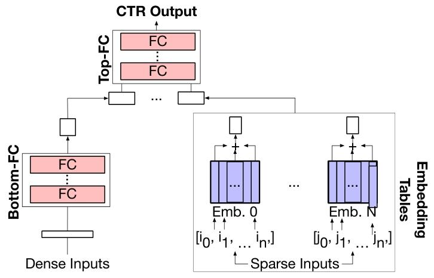
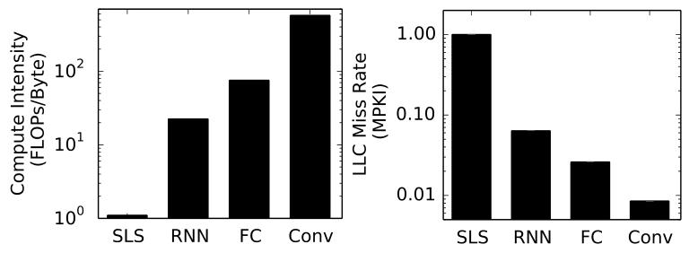
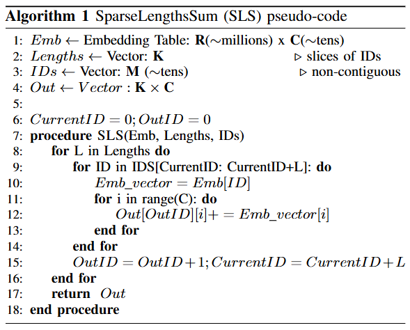

# 关于推荐系统嵌入表的相关知识

## The Architectural Implications of Facebook’s DNN-based Personalized Recommendation

### II. 背景

#### C. 嵌入表
与卷积神经网络（CNNs）和循环神经网络（RNNs）相比，用于推荐系统的深度神经网络（DNNs）的一个关键区别特征是嵌入表的使用。如图3所示，嵌入表用于将稀疏输入特征转换为密集特征。然而，**_嵌入表在存储容量大、计算密度低和内存访问模式不规则等方面，给高效执行带来了独特挑战_**。
- **大存储容量**：在生产规模的推荐模型中，单个嵌入表的大小从几十兆字节到几吉字节不等。此外，根据推荐模型的具体用例，嵌入表的数量从4个到40个不等（详见第三节）。总体而言，单个推荐模型的嵌入表可能消耗高达几十吉字节的内存。因此，_**运行生产规模推荐模型的系统需要大容量的片外存储，如动态随机存取存储器（DRAM）或密集型非易失性存储器**_ 。
- **低计算强度**：如图5（左）所示，与RNN（5.5次浮点运算/字节）、FC（18次浮点运算/字节）和CNN（141次浮点运算/字节）层相比，SparseLengthsSum（SPS）的计算强度（例如操作强度）显著较低，仅为0.25次浮点运算/字节。如图5所示，与典型的FC、RNN和CNN层相比，嵌入表的计算密度较低（此处考虑的RNN层通常出现在循环自然语言处理模型中，而FC和CNN层则是在ResNet50中发现的 ）。回想一下，_**嵌入表操作（在Caffe2中实现为SparseLengthsSum运算符 ）需要读取嵌入表中的一小部分行。然后，根据输入的稀疏ID进行索引的这些行被求和。虽然对于给定的输入，不会读取整个嵌入表，但这些访问遵循高度不规则的内存访问模式（算法1中的伪代码）**_。
- **不规则内存访问**：在生产数据中心的英特尔Broadwell服务器上，这 **_导致了较高的末级缓存（LLC）缺失率_** 。例如，图5（右）显示，生产规模推荐模型中典型的SparseLengthsSum运算符的LLC缓存缺失率为8 MPKI ，而RNN、FC和CNN层的缓存缺失率分别为0.5 MPKI、0.2 MPKI和0.06 MPKI。_**先前的工作表明，嵌入表查找的重用率较低；高缺失率是强制性缺失而非容量缺失的结果**_。操作系统相关活动的额外干扰、处理器相关的页表基址寄存器（TLB）缺失处理以及预取污染 ，都可能加剧观察到的缓存缺失率。此外，逐元素求和是一种低计算强度的操作。由于其高度不规则的内存访问模式和低计算密度，与应用于FC和CNN层的方法相比，高效的嵌入表操作需要独特的解决方案。 

图3：推荐模型的简化模型架构。模型的输入是一组密集和稀疏特征。稀疏特征是推荐模型特有的，通过嵌入表（蓝色部分）转换为密集表示。嵌入表的数量/大小、每个表的稀疏特征（ID）查找数量、底部全连接层（Bottom-FC）和顶部全连接层（Top-FC）的深度/宽度会根据具体用例而有所不同。 

图5：与全连接层（FC）、卷积神经网络层（CNN）和循环神经网络层（RNN）相比，在推荐系统中见到的嵌入表操作（在Caffe2中为SparseLengthsSum，简称SLS）呈现出较低的计算密度（左图）和较高的末级缓存（LLC）缺失率（右图）。 

>### III. 大规模个性化推荐
>
>本节介绍了三类生产规模推荐模型（RMC1、RMC2和RMC3）的模型架构。本文聚焦这三类推荐模型，主要有两个原因。其一，这些模型在嵌入表的数量和大小、每个嵌入表的稀疏ID数量以及FC层的大小等方面有着不同的配置。这些配置决定了计算密度、存储需求和内存访问模式，进而可能促使不同的系统和微架构优化。其二，这些模型消耗了Facebook数据中心65%的推理周期（见图1）。
>
>### A. 生产推荐流程
>
>如图6所示，个性化推荐是通过对内容进行分层排序来实现的。以推荐社交媒体帖子为例，当用户与基于网络的社交媒体平台进行交互时，会发出获取相关帖子的请求。在任何给定时间，可能会有数千条相关帖子。基于用户偏好，平台必须推荐排名前十的帖子。这一过程通过两个步骤完成：过滤和排名 。
>首先，可能的帖子数量（数千条）会大幅减少。这一步是通过轻量级机器学习技术（如逻辑回归）来实现的。与使用更复杂的基于DNN的解决方案相比，使用轻量级技术以较低的运行时间换取了较高的准确性。在需要更高准确性时，过滤步骤会使用基于DNN的推荐模型，推荐模型1（RMC1）就是这样一个例子。
>接下来，对帖子子集进行排名，并向用户展示排名前十的帖子。这是通过基于DNN的推荐模型完成的。与用于过滤内容的推荐模型相比，用于更精细排名的模型通常在FC层和嵌入表方面规模更大。例如，在对社交媒体帖子进行排名时，重量级推荐模型（即RMC3）由更大的底部FC层组成，这是因为该服务使用了更多密集特征。另一类重量级推荐模型（即RMC2）则包含更多嵌入表，因为它要处理具有更多稀疏特征的内容。
>SLA要求：在轻量级过滤和重量级排名这两个步骤中，每个用户查询都必须考虑许多帖子。每个查询都必须在服务级别协议（SLA）设定的严格延迟约束内进行处理。对于个性化推荐而言，如果未达到延迟目标，作业将被抢先终止，从而降低推荐结果的质量。SLA要求的延迟范围从几十毫秒到几百毫秒不等 。因此，在分析和优化生产数据中心的推荐系统时，不仅要考虑单个模型的延迟，还要考虑在SLA约束下的吞吐量指标。在数据中心，通过对查询进行批处理并在同一台机器上共置推理任务（第五节和第六节），来平衡吞吐量与严格的延迟要求。
>
>### B. 推荐模型的多样性
>
>表一展示了三类推荐模型（RMC1、RMC2和RMC3）的代表性参数。虽然这三种类型的模型都遵循通用架构（图3），但它们在嵌入表的数量和大小、嵌入表查找次数以及FC层的深度/宽度方面存在很大差异。为了突出这些差异，我们将每个特征按照所有模型中的最小实例进行了归一化处理。底部和顶部FC层的大小以RMC1中第3层为基准进行归一化；嵌入表的数量、输入和输出维度以RMC1为基准进行归一化；每个嵌入表的查找次数（稀疏ID数量）以RMC3为基准进行归一化。RMC1在FC层和嵌入表方面规模较小，RMC2有很多嵌入表（内存密集型），RMC3则具有更大的FC层（计算密集型）。需要注意的是，顶部FC层中的FC参数数量不仅取决于层的维度，还取决于输入大小，而输入大小会随着嵌入表的数量（图3）而变化，并且可能非常大。
>嵌入表的数量和大小在这三类推荐模型中有所不同。例如，RMC2的嵌入表数量可能比RMC1和RMC3多出一个数量级。这是因为RMC1是在初始过滤步骤中使用的轻量级推荐模型，而RMC3用于稀疏特征较少的应用场景。此外，虽然推荐模型中嵌入表的输出维度相同（在24 - 40之间），但RMC3的嵌入表在输入维度方面是最大的。总体而言，假设使用32位浮点数据类型，RMC1、RMC2和RMC3的嵌入表存储容量分别在100MB、10GB和1GB左右。因此，运行这三种大规模推荐模型中任何一种的系统，都需要大容量的片外内存系统。
>嵌入表查找：与RMC3相比，RMC1和RMC2中的嵌入表每次输入的查找次数（即稀疏ID数量）更多。这是因为RMC1和RMC2用于具有许多稀疏特征的服务，而RMC3用于推荐社交媒体帖子，其稀疏特征较少。因此，RMC1和RMC2模型执行更多不规则内存访问，导致更高的缓存缺失率。
>MLP层：RMC3的底部FC层通常比RMC1和RMC2宽得多。这是因为在对社交媒体帖子（RMC3）进行排名时，与RMC1和RMC2支持的服务相比，使用了更多密集特征。因此，RMC3比RMC1和RMC2的计算强度更高。最后，需要注意的是，FC层的宽度不一定是2的幂次方，也不一定与缓存行对齐。 

