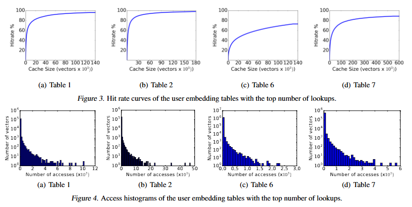

# 嵌入表相关知识补充

## BANDANA: USING NON-VOLATILE MEMORY FOR STORING DEEP LEARNING MODELS” 由 Assaf Eisenman

### 2. 背景知识

在本节中，我们将介绍两个主题的背景知识：深度学习嵌入向量及其在Facebook推荐帖子中的应用，以及非易失性内存（NVM）。

#### 2.1 嵌入向量

Facebook帖子推荐系统的目标是为用户推荐相关内容。为此训练一个排名系统的简单方法是，对帖子和用户特征进行编码，并使用它们来预测用户点击的可能性。例如，我们可以根据用户点赞的页面来表示用户。在这种情况下，每个页面将对应一个唯一的ID，这些ID会被映射到一个二进制向量的元素索引上。例如，如果一个用户点赞了ID为2和4的页面，而总共有5个页面，那么该用户的特征向量就是(0, 0, 1, 0, 1)。

另一方面，我们可以根据描述帖子的词语来表示帖子。在这种场景下，每个词语会对应一个唯一的ID，同样，这些ID也会被映射到二进制向量的元素索引上。例如，如果帖子文本是“red car”，而词库是“bicycle, motorcycle, car, blue, red, green”，那么帖子的特征向量就是(0, 0, 1, 0, 1, 0)。

由于不同语言中的单词总数达数百万级别，而页面数量更是达数十亿级别，这样的二进制向量会非常大且稀疏（即大部分元素为零）。此外，这种简单的表示方式不会将一个页面的上下文信息应用到另一个页面。换句话说，非常相似的页面仍然会被编码为单独的ID。

然而，如果我们用一个短向量而不是单个二进制数字来表示每个单词或页面，就可以表示出单词或页面之间的相似性。将项目映射到向量空间的过程称为嵌入。嵌入的学习和创建方式是，在语义、参与度等方面含义相似的稀疏ID，在距离上也会更接近。距离通常在欧几里得空间中测量。推荐帖子是推荐系统的一个具体用例（Covington等人，2016；Cheng等人，2016；Wang等人，2017），其目标是根据用户过去的行为推荐最相关的内容。

在Facebook，嵌入向量存储在专门的表中，其中每一列代表一个嵌入向量，其列ID对应向量的ID。Facebook维护两种类型的嵌入：用户嵌入和帖子嵌入。每个用户嵌入表通常可以表示某种用户行为，如点击、点赞和页面浏览量，每个嵌入向量代表用户采取的特定行为。帖子表可以表示帖子的实际内容，例如帖子中出现的特定短语。

如图1所示，推荐模型接收输入ID，提取相应的嵌入向量，并使用深度神经网络（NN）对其进行处理。

我们模型中典型的向量维度在32到64之间，每个元素占用1 - 4个字节。嵌入表可以包含数千万个嵌入向量，每个表的大小约为GB级别。由于延迟要求，这些表通常存储在DRAM中。

嵌入向量在训练过程中计算，对于每个数据样本（例如用户和帖子对），只有相应ID访问的列会被修改。因此，随着训练遍历数据集，大多数（如果不是全部）列都会被更新，其中许多列会被多次更新。然后在推理过程中，嵌入向量在不进行任何调整或修改的情况下被使用。这些向量可能每几个小时重新训练一次。

#### 2.2 NVM

非易失性内存（NVM）是一种新的内存技术，与闪存相比，它提供了更低的延迟和更高的吞吐量，但性能低于DRAM，成本也比DRAM低得多。NVM有两种形式因素：DIMM形式因素，它是字节可寻址的；或者作为块设备。目前，Intel处理器不支持DIMM形式因素（Mellor，2018），而且它比将NVM用作块设备要昂贵得多。因此，对于我们的用例，我们主要关注块设备形式因素。

为了了解如何使用NVM，我们探究了它的性能特征。为此，我们在一个NVM设备上运行了广泛使用的I/O工作负载生成器Fio 2.19（fio）。我们使用Libaio I/O引擎，以4个并发作业、不同的队列深度运行Fio工作负载。队列深度表示对设备未完成的I/O请求数量，它可以作为我们并行运行的线程数量的代理。我们测量了一个容量为375GB的NVM设备的延迟和带宽。

图2展示了4KB随机读取工作负载下，只读工作负载的平均延迟、第99百分位数延迟和带宽。结果表明，延迟和带宽之间存在权衡：更高的队列深度可以提供更高的读取带宽，但代价是延迟增加。需要注意的是，即使在高队列深度下，NVM的读取带宽（2.3GB/s）仍然比DRAM（例如75GB/s）低30多倍。

需要注意的是，与DRAM不同，NVM的耐久性会随着其使用寿命内写入次数的增加而下降。典型的NVM设备每天可以重写30次，否则就会开始出现错误。幸运的是，Facebook中向量的更新频率通常在每天10 - 20次之间，低于会影响NVM设备耐久性的速率。 

### 3. 工作负载特征分析

本节介绍了Facebook用户嵌入向量的工作负载特征分析。我们分析了一个包含10亿次嵌入向量查找的生产工作负载，它代表了单个模型超过一小时的流量。目前，每台服务器上的模型数量和每个模型的大小都受到服务器DRAM容量的限制。

每个用户嵌入表通常代表不同类别的用户行为。例如，一个表可能代表用户喜欢的页面，其中每个嵌入向量代表一个页面。因此，Bandana中的一个请求通常会涉及多个表，并且每个表中包含多个向量查找。由于要为单个用户对不同帖子进行排名，帖子嵌入向量的读取频率要高得多，帖子查找约占嵌入向量总读取量的95%。另一方面，用户嵌入向量包含更多特征，消耗了约75%的总DRAM容量。

在我们分析的模型中，嵌入向量为128字节，包含64个fp16类型的元素。表1描述了模型中一些有代表性的用户嵌入表的特征。每个嵌入表由1000万到2000万个向量组成（大小在1.2GB到2.4GB之间）。单个请求中包含的向量数量因表而异，嵌入表8中平均有17.68次向量查找，而嵌入表2中则高达92.8次。该表还展示了用户嵌入表之间的向量查找分布情况。向量查找中最大的部分由嵌入表2处理，它承担了25%的用户嵌入向量查找。强制性缺失表示这些查找中有多少是唯一的（即有多少查找对应于在跟踪中之前未读取的向量）。强制性缺失的百分比越低，该表越有可能被有效地缓存。

为了更深入了解用户嵌入向量的重用情况，我们计算了每个嵌入表的堆栈距离（Mattson等人，1970）。为了计算堆栈距离，我们假设每个表都缓存在一个无限的LRU队列中，向量的堆栈距离是指它在被请求时在LRU队列中的排名，从淘汰队列的顶部开始计数。例如，如果被请求的向量在被请求时位于淘汰队列的第二个位置，那么它的堆栈距离就等于2。这使我们能够计算出命中率曲线与分配给嵌入表的内存之间的函数关系。**图3描绘了在10亿次请求的跟踪中，查找次数最多的四个嵌入表的命中率曲线。图4展示了这些表的访问直方图，其中每个条形表示有多少个向量（X轴）被访问了特定次数（Y轴）。这些直方图表明，不同表的访问模式差异很大。例如，表2中的向量被读取的次数可达数十万次，而表7中没有向量被读取超过1000次。** 

 

